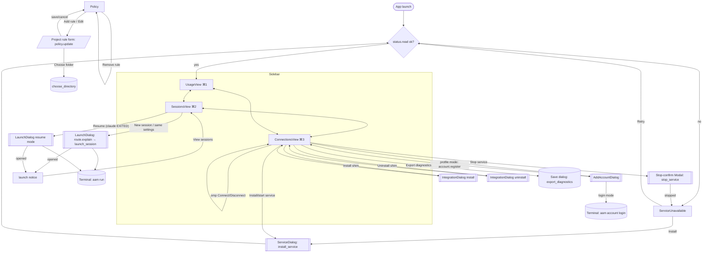

# desktop (`apps/desktop`)

## 개요
Tauri 2 + React 19/Vite 메뉴바 앱(제품명 Ojak, bundle id `ai.aam.desktop`). WebView는 허용된 RPC와 고정 Tauri 명령으로만 서비스에 닿는다. 관리 작업은 앱 안의 `aam` 바이너리를 실행한다.

## 화면 (`src/`)
| 메뉴 | 파일 |
|---|---|
| 지금 사용 현황 | `UsageView.tsx` (브릿지가 없으면 도구별 남은 한도·리셋 카드가 먼저. omp 요청 수는 브릿지 연결 후에만. 공급자별 자동/수동, 접힌 배정 설정 `AllocationSettings.tsx`) |
| 세션 | `SessionsView.tsx` |
| 연결 | `ConnectionsView.tsx` |
연결 화면에서 '로그인 필요' 계정은 [다시 로그인]으로 그 프로필의 공식 로그인을 연다(`aam account login --account`). 새 프로필을 만들지 않는다.
공통: `App.tsx`, `state.ts`(`useSnapshot`, `useBridge`, `useAction`, 공급자 별칭), `api.ts`, `types.ts`, `dialogs.tsx`, `components.tsx`, `i18n.ts`.

## 글꼴·조판 (`styles.css`)
- 본문 글꼴은 앱에 넣은 Pretendard Variable(`src/assets/fonts`, SIL OFL 1.1, 약 2 MB)이다. macOS·Windows에서 한글·영문·인도네시아어를 같은 글꼴과 같은 굵기 단계로 그린다. 코드는 `--mono`(SF Mono/Menlo, Windows Cascadia Mono/Consolas).
- 타입 스케일은 `--fs-title` 22 · `--fs-heading` 14 · `--fs-body` 13 · `--fs-meta` 12 네 단계다. 본 창의 보조 문구는 12px 아래로 내리지 않는다(트레이 팝오버만 예외). 숫자는 전역 `tabular-nums`.
- `:lang(ko)`은 `word-break: keep-all`로 어절 단위 줄바꿈과 넓은 행간을 쓴다. `:lang(id)`는 긴 단어만 끊는다. 인도네시아어 문구는 사이드바·버튼 길이에 맞춰 짧게 쓴다.
- 서비스가 보내는 계정 라벨의 `기본 프로필`은 `useSnapshot`이 받는 즉시 `accountLabel`로 표시 언어로 바꾼다(라벨은 서비스로 되돌려 보내지 않음). 호스트 연결 안내는 `hosts.note.*` 키로 받는다(`launcher.md` 호스트 연결).
- **오류 표시** (`components.tsx` `ErrorMessage`, `errors.ts` `describeError`): `ApiError.code`에 `error.code.<CODE>`(en·ko·id) 문장이 있으면 그것을 주 문장으로 보이고, 서비스·CLI·앱이 보낸 원문(`ApiError.message`)은 접힌 `
`("자세히")에 바이트 그대로 둔다. 원문에는 변수·옵션 이름, 경로, 설정 파일 위치가 들어 있어 지원 문의와 진단에 쓴다. 주 문장에는 원문의 값을 옮기지 않는다(백엔드가 이름·경로를 기계가 읽는 형태로 주지 않기 때문에 `params`는 아직 없다). 사전에 없는 코드는 원문이 주 문장이고 "자세히"는 없다. 원문이 비었거나 주 문장과 같으면 "자세히"도 없다. 이메일 가림(`privacyText`)은 두 곳 모두 적용한다. 새 `ApiError::new("CODE", …)`를 화면까지 보내려면 `error.code.CODE`를 세 사전에 모두 추가한다(`errors.test.ts`가 en·ko·id 누락, 자리표시자 불일치, 한글 섞임(en·id), 앱 셸(`main.rs`)이 직접 내는 코드의 누락을 막는다). CLI·서비스 메시지 자체는 한국어뿐이다.
- `main.rs` `run_management`는 `aam`이 stderr에 내는 `aam: <문장> (<CODE>)`에서 코드를 되살려 `ApiError`로 넘긴다(`management_error`). 이 모양이 아니면 `INSTALLATION_ERROR`와 원문이다. 이 코드가 없으면 연결·서비스·준비 작업의 실패가 모두 한 코드로 뭉쳐 화면이 안내를 고를 수 없다.
- Windows 화면 확인용 `PrintWindow` 캡처는 DWM의 보이지 않는 테두리까지 담아 왼쪽·오른쪽·아래에 검은 띠가 생긴다. 실제 창 문제가 아니므로 `DWMWA_EXTENDED_FRAME_BOUNDS`로 잘라서 본다.
- 캐릭터(깍이·호랑이)는 세 곳에만 나온다: 사용 현황의 호출 없음(낮잠, `tiger-nap.webp`, 회색 가는 선 + 주황 포인트 하나, 조회 완료·호출 0회일 때만, 순위 칸이 비면 한 줄 전체 사용), 공급자 전체 소진 띠, 정보 로고 7번(쌀가게). 그림은 장식(`alt=""`)이고 정보와 문구는 그대로 둔다(농담 문구 없음). 설정의 "캐릭터 표시"(`ojak.characters`, localStorage)를 끄면 낮잠 그림만 빠진다. 준비 완료·계정 카드·트레이 팝오버에는 넣지 않는다.

## 처음 설치·설정
- `SetupGuide`는 서비스·shell PATH·계정 보유 도구의 shim 설치와 실제 명령 검증을 구분한다. 수동으로 다시 열거나 상태를 조회한 직후에는 ‘설정 적용됨 · 실제 명령은 아직 미확인’으로 표시한다. 실패한 단계 아래에는 `notices`의 이유와 다음 행동을 표시 언어로 보여 준다. 툴팁만 쓰지 않는다.
- 상태 조회는 `aam setup --status`로 셸을 실행하지 않는다. ‘다시 점검’은 Unix에서 새 로그인 셸의 시작 파일을 실행하고, Windows에서는 PowerShell을 띄우지 않고 저장된 시스템·사용자 PATH를 직접 해석한다. ‘시작하기’는 누락된 설치와 명령 검사를 진행한다. 명령별 최대 5초이며 기존 터미널·IDE의 적용 여부를 보장하지 않는다.
- 계정 추가 대화상자 등 다른 대화상자가 열리면 준비 안내를 숨기고, 닫힌 뒤 상태를 다시 확인한다. 계정 표시는 가림 설정을 따른다.
- ‘나중에’로 닫아도 사이드바의 ‘Ojak 시작하기’로 다시 열 수 있다. 감지된 omp는 체크박스(기본 꺼짐)로 사용자가 직접 동의했을 때만 broker·bridge·observer를 함께 연결한다. README의 "omp 브릿지 기본 꺼짐" 고지와 같아야 한다. 연결 오류를 표시하며, omp 재실행/확장 재로드·기존 역할 모델 선택이 필요할 수 있음을 알린다. 설정 완료와 실요청 경유 관측은 별개다.
- Windows에서 감지된 omp는 미지원 안내만 표시하며 준비 완료 조건이나 설치 요청에 포함하지 않는다(`ompSupported`). Windows·Unix 명령 확인의 범위를 각각의 언어로 안내한다.

## 설치 후 모니터링
- 계정 한도와 omp 브릿지 요청 수의 범위를 상단에 설명하고 세션·연결 화면으로 이동하는 버튼을 제공한다. omp 미연결은 CLI 실행 실패가 아닌 선택 기능 안내다.
- omp 브릿지가 연결되지 않았으면 요청 수 순위·기간 선택·빈 '호출 없음' 칸을 띄우지 않는다. Claude·Codex 계정 카드(남은 한도·리셋)가 먼저 나오고, omp 연결 안내는 그 아래 한 줄이다.
- `useBridge`는 기간이 바뀌면 이전 기간의 사용 내역을 표시하지 않는다. 조회 중·조회 실패·조회 성공 후 0회를 구분하며 실패한 사용 내역을 0회나 최신 집계로 표시하지 않는다.
- 경로 확인 불가는 재시작만으로 해결된다고 약속하지 않는다. 새 기록에서도 지속되면 연결 화면의 진단 내보내기로 점검하도록 안내한다.
- 주간 한도(모델별 주간 한도 포함) 아래에 공급자가 제공한 `resetsAt` 기준 남은 초기화 시간을 표시한다. 툴팁은 정확한 현지 날짜·시간이며, 시각이 없으면 생략하고 지난 시각은 ‘리셋 확인 대기’로 표시한다.
- 사용 현황의 한도 배지는 `snapshot.quotaSummaries`를 그대로 사용한다. 화면에서 배정 결론을 재계산하지 않으며, 요약이 없는 구서비스에는 갱신 필요를 안내한다. 안전 잔여량 안쪽도 대안이 없으면 CLI·omp 모두 남은 한도를 사용한다. 이 배지는 모델·프로젝트·동시 슬롯이 정해지지 않은 현재 한도 요약이며 특정 실행 허용 여부는 아니다.
- 서비스 `quota_summary.rs`와 `state.ts`는 공급자별 workspace/subject, OAuth pin, workspace 없는 이메일 근거로 그룹을 만든다. 신원 없는 관측은 동일 이메일의 확인된 그룹이 하나일 때만 붙인다. 요약은 모든 `accountIds`를 반환하고 화면은 대표 계정 ID로 찾는다. 같은 bucket ID는 최신 관측을 쓰며 소진·모델 제한·차단은 구분한다.

## Tauri 명령 (`src-tauri/src/main.rs`)
- `rpc` 허용 목록: `status.read`, `quota.refresh`, `route.explain`, `policy.update`, `account.register`, `account.update`. 그 외 `METHOD_DENIED` (`main.rs:35-51`).
- 관리 작업(`integration_action`, `omp_bridge_action`, `omp_broker_action`, `install_service`, `stop_service` …)은 `run_management`(`main.rs:195`)가 같은 폴더의 `aam`을 `AAM_HOME`과 함께 실행한다.
- `bridge_usage`(`main.rs:561`): `logs/bridge.log`를 최대 4 MiB 읽어 5분 단위로 모은다.
- `launch_session`: 새 관리 세션을 Terminal에서 연다.
- `service_version_status` / `service_restart`: 앱만 DMG로 덮어써 서비스가 예전 버전으로 남은 경우를 위한 명령. 상태는 읽기 전용 비교(`aam_launcher::service_version`), 재시작은 사용자가 [서비스 다시 시작]을 눌렀을 때만 `service_version::restart`(lease 검사 → 재시작 → 버전 확인)를 부른다. 화면은 `SetupGuide.tsx`의 `ServiceVersionNotice`(앱 시작·서비스 시작 시각이 바뀔 때 비교)가 대시보드 위에 버튼 하나짜리 안내를 띄운다. 최근 15분 안에 쓴 omp 브릿지 세션이 있으면 `update.warn` 문구로 먼저 경고하고 한 번 더 누르게 한다. 쓰는 중인 관리 세션은 서비스가 `SESSION_BUSY`로 거절하고 화면이 나중에 다시 누르라고 안내한다. 성공 뒤 서비스 버전이 앱과 같은지 다시 읽어 확인하며, 실패하면 기존 서비스를 그대로 두고 현지화한 오류를 보인다. 연결 화면의 서비스 표에도 서비스 버전이 나온다.
- `updates_status` / `install_update` / `restart_after_update`: 서명 공개키가 자리표시자가 아니면 시작 시·24시간마다 업데이트를 확인한다. 설치 뒤 `/bin/launchctl kickstart -k gui/<uid>/ai.aam.service`로 새 `aam-service`를 적용하고 앱을 재실행한다. RPC 허용 목록은 넓히지 않는다.

## 공급자 별칭 (`state.ts:13-19`)
`ojak-*`와 이전 `aam-*`를 모두 원래 공급자로 모은다. 연결 화면의 로그인 수는 `ojak-*`만 센다.

## omp 요청 경로 표시
- `usage-routes.ts`는 `ObservedAttribution.route`의 명시적 근거만 사용한다. `direct`는 Ojak 미경유 요청, `bridge`는 경유, 명시적인 `unknown`은 경로 확인 불가다. 경로가 없는 완료·모델 선택 기록은 이 패널에서 제외한다.
- 원래 공급자 이름, 동일 폴더·모델의 다른 브릿지 세션, 브릿지 로그 누락으로 경로를 판단하지 않는다. 제거된 `bridge.status.folders` 메모리에도 의존하지 않는다.
- 안내 바로 아래 **프로젝트별 연결 내역**에서 프로젝트·모델/공급자·연결 상태·마지막 확인 시각을 표시한다. 명시적 `direct`는 ‘직접 연결’, 명시적 `unknown`은 ‘확인 필요’로 구분한다. 같은 프로젝트·모델도 두 종류의 관측이 있으면 각각 표시하며, 이 목록은 현재 연결 설정이나 전체 트래픽 감사를 뜻하지 않는다.
- 프로젝트는 전체 cwd로 구분하고 이름은 마지막 폴더명, 툴팁은 전체 경로를 사용한다. 가림 모드에서는 이름과 툴팁 경로를 모두 숨긴다. cwd가 없으면 ‘프로젝트 정보 없음’으로 남긴다.
- 마지막 확인은 해당 프로젝트·공급자·모델·경로의 `recordedAt` 최댓값이다. 응답 성공 시각으로 단정하지 않는다. 중복 관측을 합치되 다른 프로젝트의 시각은 섞지 않는다.
- 같은 모델에 직접 요청 근거와 경로가 없는 완료 기록이 함께 있어도 완료 기록 때문에 ‘확인 필요’ 행을 만들지 않는다. 명시적인 `unknown` 관측은 별도로 유지한다. 관측 행의 횟수는 미확인으로 남기고 브릿지 대화 요청 수·순위에 더하지 않는다.
- ‘15분 / 1시간 / 오늘’은 관측 시각에 적용한다. 계정 고정의 1시간 만료나 서비스 재시작 때문에 경유 기록을 미경유로 바꾸지 않는다.

## 빌드
- `npm run dev` → `scripts/dev.mjs` (debug cargo build → `src-tauri/binaries/` 복사 → `tauri dev`, Vite 127.0.0.1:1420)
- `npm run build` → `scripts/build.mjs` (release cargo build → 복사 → `tauri build`, 결과 `target/release/bundle/{macos,dmg}`)
- `npm run typecheck` → `tsc -b`
- `src-tauri/binaries/`는 gitignore이며 위 스크립트만 만든다. Tauri crate는 workspace default-members에서 빠져 있다.

## Screen Flow / Lifecycle
<!-- screen-flows-v3: 2026-09-27, type=web-frontend -->

| Stage | 상태 | 근거 |
|---|---|---|
| accounts · Create | ✅ | AddAccountDialog: profile mode rpc account.register (apps/desktop/src/dialogs.tsx:36) → service dispatch (crates/service/src/lib.rs:405, register :722); login m |
| accounts · Read | ✅ | useSnapshot rpc status.read every 3s (state.ts:220,240) → snapshot.accounts rendered in ToolPanel table (ConnectionsView.tsx:75-77), UsageView quota rows (Usage |
| accounts · Update | ✅ | include/exclude toggle rpc account.update {enabled} (AllocationSettings.tsx:47, service lib.rs:406/690); priority reorder & preferred account via policy.update (PolicyV |
| accounts · Delete | ❌ | No remove button in desktop src; rpc allowlist lacks any account.remove (src-tauri/src/main.rs:37-44); service dispatch has no removal method (crates/service/sr |
| sessions · Create | ✅ | SessionsView New session (SessionsView.tsx:29) / same-settings (SessionsView.tsx:59) → LaunchDialog (App.tsx:85) → route.explain preview (dialogs.tsx:106) → lau |
| sessions · Read | ✅ | Managed sessions from snapshot.sessions (SessionsView.tsx:20) + omp bridge sessions via useBridge (SessionsView.tsx:15-18, state.ts:264); detail inspector dl wi |
| sessions · Update | 🚧 | Only resume: button gated to tool==='claude' && nativeSessionId && state==='EXITED' (SessionsView.tsx:58) → LaunchDialog with resumeSessionId (App.tsx:37, dialo |
| sessions · Delete | ❌ | No stop/terminate/dismiss action in SessionsView.tsx; no session.* RPC in allowlist (src-tauri/src/main.rs:37-44). Sessions end only when the terminal process e |
| policy/project rules · Create | ✅ | ProjectRoutesEditor 'add rule' opens draft form (AllocationSettings.tsx:164) → submit appends route (AllocationSettings.tsx:147-148) → rpc policy.update {projectRoutes} with ex |
| policy/project rules · Read | ✅ | snapshot.policy rendered: criteria/revision badge (AllocationSettings.tsx:64-72), order list (:77-85), preferred accounts (:89-96), routes table (:136-141); sidebar aut |
| policy/project rules · Update | ✅ | Edit route (AllocationSettings.tsx:140 → :147); allocationMode select (:68), safetyReserve (:53,69), priority move (:43), preferred (:55-61), sidebar automatic toggle ( |
| policy/project rules · Delete | ✅ | Remove button filters route and saves via policy.update (AllocationSettings.tsx:140 → save :123-130); preferred account cleared with empty option (AllocationSettings.tsx:93, se |
| connections · Create | ✅ | Shim install: HostsPanel install (ConnectionsView.tsx:97) → IntegrationDialog → integration_action install (dialogs.tsx:124, main.rs:407-409); Service install:  |
| connections · Read | ✅ | host_connections on mount (ConnectionsView.tsx:112-113, main.rs:419); omp broker/bridge status (ConnectionsView.tsx:18); service panel startedAt/protocol/notice |
| connections · Update | ❌ | No edit surface for shim directory, bridge port or broker config; only recheck (ConnectionsView.tsx:52,97) and re-run install (idempotent 'install/start' button |
| connections · Delete | ✅ | Shim uninstall: HostsPanel (ConnectionsView.tsx:97, disabled when no shims) → IntegrationDialog → integration_action uninstall (dialogs.tsx:124, main.rs:410); s |

### 이슈
- [medium] accounts · Delete: Users cannot remove a registered account from the desktop app (no UI and no service RPC). They can only exclude it (account.update enabled=false, AllocationSettings.tsx:47). Stale accounts pile up in lists and in the Policy sele
- [medium] sessions · Delete: The app cannot stop a managed session or dismiss an ORPHANED/FAILED one. While occupied>0 the service stop button is disabled (ConnectionsView.tsx:152), so a stuck session also blocks stopping the service.
- [low] sessions · Update: Resume only works for Claude sessions in EXITED state that have a nativeSessionId (SessionsView.tsx:58). Codex sessions have no resume path.
- [low] accounts · Update: AccountUpdate.maxConcurrency (crates/service/src/lib.rs:131) is supported by the backend but not exposed in the UI (⚡). Account labels cannot be renamed.
- [low] connections · Delete: ompBrokerAction('disconnect') is typed in api.ts:60, but OmpPanel disconnect only calls ompBridgeAction('disconnect') (ConnectionsView.tsx:42). The broker link cannot be removed from the UI.
- [low] connections · Create: The omp_observer_action Tauri command is registered (src-tauri/src/main.rs:427, :999) but has no frontend caller. It is a dead or backend-only (⚡) surface.
- [low] connections · Update: There is no way to edit connection settings (shim dir, bridge port, broker config). The only option is reinstalling or reconnecting.

### 다음 할 일
- [ ] accounts · Delete: add an account.remove service method that refuses when leases exist and reuses forget_account (lib.rs:191), add it to the rpc allowlist (main.rs:37-44), and put a Remove button with a confirm modal in ToolPanel (ConnectionsView.tsx:77).
- [ ] sessions · Delete: expose a session stop/dismiss RPC for ORPHANED/FAILED/ACTIVE sessions and add the action to the SessionsView inspector (SessionsView.tsx:57-59).
- [ ] accounts · Update: add a maxConcurrency input to the PolicyView order row, using account.update.
- [ ] connections: either wire omp broker disconnect and omp_observer_action into OmpPanel, or remove the unused omp_observer_action handler and the 'disconnect' union member.
- [ ] sessions · Update: extend resume to Codex once the launcher supports --resume-session for codex.

## 메뉴바 (`src-tauri/src/main.rs`, `src/Popover.tsx`, `src/limits.ts`)
- 메뉴바 아이콘 옆 숫자(macOS만): 지금 쓰는 계정(최근 15분 omp 브릿지 요청 또는 실행 중인 관리 세션) 중 가장 적게 남은 한도 %. 설정의 "메뉴바 숫자" 기준(기본 30%, 0 = 끔, 100 = 항상) 이하일 때만 보이고, 여유량 안쪽이면 `⚠︎`. Windows 트레이 아이콘에는 제목이 없어 이 설정은 숨긴다. 툴팁은 항상 무엇이 가장 급한지 보여 준다. 설정은 `AAM_HOME/ui-settings.json`의 `trayThreshold`.
- 왼쪽 클릭: 잔여 한도 팝오버(`popover` 창, 같은 번들을 `main.tsx`가 창 라벨로 분기). 헤더 오른쪽 버튼으로 사용량을 바로 다시 조회한다. 공급자(Claude·Codex·Gemini)마다 카드 하나, 계정은 카드 안의 줄. 줄을 누르면 쓰는 모델과 한도별 막대·리셋 시간을 펼친다. 모델 전용 한도는 그 모델을 쓸 때만 진하게. 이메일은 대시보드의 개인정보 가림 설정을 따른다.
- 한도 묶기(`limits.ts`, 테스트 `npm run test:desktop`): 라벨 끝이 같아도 모델이나 값이 다르면(`Gemini · 주간` / `Claude & GPT · 주간`) 앞부분을 붙여 따로 둔다.
- 잔여 색(`limits.ts` `remainingTone`): 사용량 화면과 팝오버가 같은 기준을 쓴다. 공급자·모델과 무관하게 남은 %만 본다. 31% 이상 초록, 30% 이하 주황, 안전 여유분 이하·소진 빨강, 관측 없음 회색. 공급자 색은 이름 옆 점과 사용량 그래프에만 쓰고 잔여 막대에는 쓰지 않는다.
- 크레딧·추가 사용량 표시(`UsageView.tsx`, `ConnectionsView.tsx`, `Popover.tsx`, `limits.ts`): 서비스가 매 스냅샷마다 다시 계산한 `quotaSummaries[].kind`가 `credits`면 "크레딧 사용 중", `extra`면 "추가 사용량 사용 중"(en Using credits/Using extra usage, id Pakai kredit/Pakai penggunaan tambahan). 크레딧 잔액은 숫자로 읽힐 때만 "크레딧 N개 남음"(반올림, 금액 아님), 추가 사용량은 USD로만 "$12.40 / $50"(상한 없으면 "$12.40 사용"). 옵트인이 꺼져 있는데 관측이 있으면 "크레딧 있음 (꺼짐)"/"추가 사용량 켜짐 (Ojak에서는 꺼짐)" 중립 안내만 보이고 한도가 리셋되면 바로 사라진다. 설정은 사용 현황 → 배정 설정의 스위치 둘(Codex는 '크레딧', Claude는 '추가 사용량 (API 요금)')이고 켜도 한도가 남은 계정이 항상 먼저다. 둘 다 과금될 수 있고 Ojak이 쓴 금액을 막거나 볼 수 없다는 경고를 함께 보인다.
- 오른쪽 클릭: 상태·대시보드 열기·종료 메뉴. 창을 닫으면 Dock에서 사라지고 메뉴바에만 남는다.
- 설정(⌘, / Ctrl+,): 언어(시스템/한국어/English/Bahasa Indonesia), 로그인 시 자동 실행, macOS 메뉴바 숫자 기준(Windows에서는 숨김), 리셋 전 사용 알림, 앱 정보. 종료는 "앱만 종료 / Ojak 사용 중지 후 종료" 확인 창을 거친다(`aam deactivate`). 사용 중지는 로그인 자동 실행도 끈다. Windows 문구는 `i18n.ts`의 Windows 덮어쓰기로 LaunchAgent·이 Mac·메뉴바를 트레이·이 PC로 바꾼다.
- 리셋 전 사용 알림: 트레이 폴링(5초)이 서비스의 `quotaSummaries[].expiring`을 읽어 `tauri-plugin-notification`으로 시스템 알림을 보낸다(macOS 알림 센터, Windows 토스트). 창이 닫혀 있어도 동작한다. 같은 (계정 묶음 최소 ID, 리셋 시각)은 한 번만 보내며 `ui-settings.json`의 `expiringNotified`에 ID와 시각만 저장하고 지난 리셋은 지운다. 본문에는 이메일 대신 공급자 이름만 쓴다. 설정 `expiringNotify`(기본 켬). 데스크톱 플러그인은 OS 허용 상태를 읽지 못해(항상 Granted) OS에서 막혀 있으면 조용히 표시되지 않는다. 판정 기준과 "곧 리셋 계정 먼저 쓰기"는 사용 현황 → 배정 설정에 있고, 해당 계정 줄에 파란 안내가 붙는다.
- 호랑이(브랜드 풍자): 앱 안에서는 두 곳에만 나온다. ① 사용 현황 공급자 패널: 배정에 포함된 계정이 모두 `resting`(소진·차단)일 때만 호랑이 저울 띠와 가장 빠른 리셋 시각(`limits.ts` `allResting`). 하나라도 쓸 수 있거나 판정이 불확실하면 띄우지 않는다. ② 설정 → 정보에서 로고를 7번 누르면 호랑이 쌀가게 이스터에그(다시 누르면 돌아감). 앱 문구에는 회사 이름을 쓰지 않는다. 그림은 `src/assets/tiger-shop.webp`(640px)·`tiger-strip.webp`(160px) — `docs/brand/concepts/C-tiger-scale.png`에서 일장기로 읽힐 수 있는 빨간 해를 지우고 줄인 것이다.
- 첫 실행 준비(`SetupGuide.tsx`): `setup_status`로 서비스·zsh/사용자 PATH·도구별 계정·shim을 보고, 준비가 안 됐으면 창을 띄운다. [시작하기]는 번들 `aam setup`을 실행해 빠진 단계만 설치한다(서비스 → 첫 탐지 대기 → `integration install` → `shell install`). 실패한 단계 아래에는 `notices`의 이유와 다음 행동을 보여 준다. 계정이 없으면 도구별 로그인 버튼, 끝나면 "준비 완료"와 명령을 보여 준다. [나중에]는 이번 창 세션(sessionStorage)에서만 유지한다.
- 로그인 자동 실행: `tauri-plugin-autostart`(macOS `~/Library/LaunchAgents/Ojak.plist`, Windows 레지스트리 Run 키). 인수 `--autostart`로 켜지면 대시보드를 띄우지 않고 메뉴바에만 둔다(메인 창은 설정에서 `create: false`로 두고 setup에서 `visible(!autostart)`로 만든다. 만든 뒤 `show()`로 바꾸는 방식은 Windows에서 반영되지 않았다. `tauri.windows.conf.json`은 창 정의를 통째로 덮으므로 두 파일을 함께 고친다). 설치본 첫 실행 때 한 번 켜고 `ui-settings.json`에 `autostartChosen`을 남긴다. 그 뒤 사용자가 끄면 다시 켜지 않는다. 개발 빌드는 기본으로 켜지 않는다. 백그라운드 서비스(`ai.aam.service`)는 이 설정과 별개로 LaunchAgent `RunAtLoad`로 시작한다.
