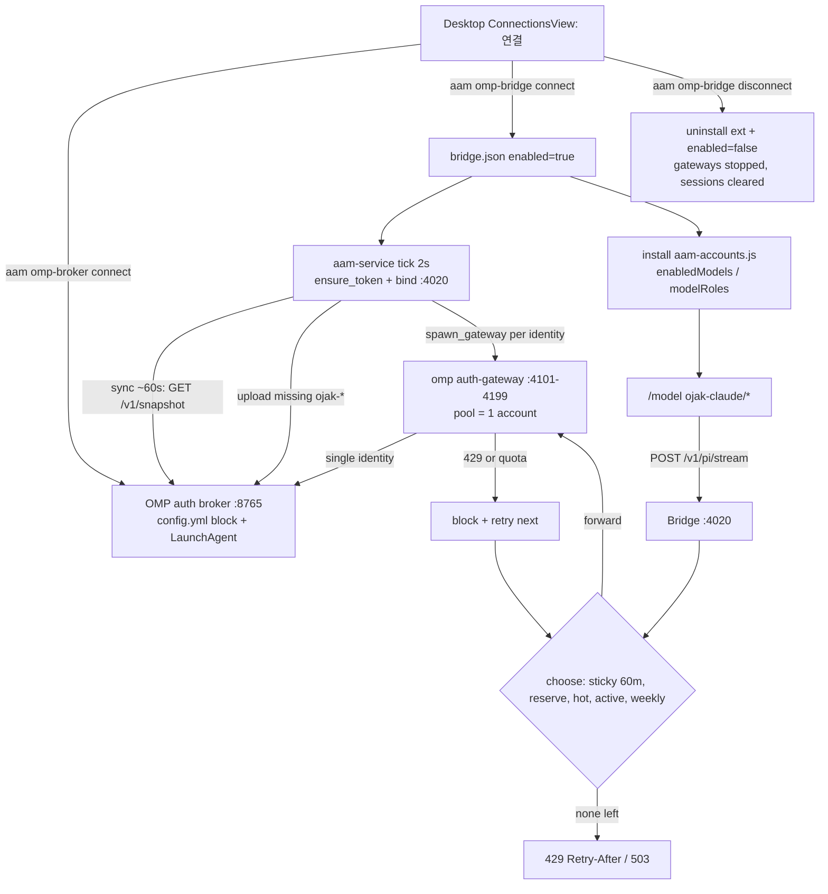
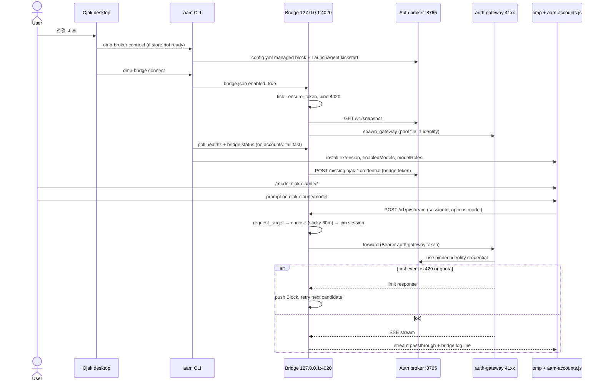

# omp-bridge

## 개요
omp `/login`의 `Ojak · …` 공급자(`ojak-claude` 등)를 고르면 요청이 `127.0.0.1:4020` 브릿지로 오고, 브릿지가 세션마다 계정을 골라 계정별 omp gateway(4101–4199)로 넘긴다. gateway는 OMP auth broker(:8765)에서 그 계정 하나만 본다. 설계 문서: `docs/specs/2026-09-26-aam-account-bridge.md`.

## 구성
- 서비스 쪽: `crates/service/src/bridge.rs` — `Bridge::start`(`:370`), `handle`(`:565`), `stream`(`:636`), `choose`(`:205`), `spawn_gateway`(`:934`)
- launcher 쪽: `crates/launcher/src/omp_bridge.rs`(`aam omp-bridge`), `omp_broker.rs`(`aam omp-broker`); Windows 로그인 자동 실행과 감독은 `omp_broker_windows.rs`.
- omp 확장: `integrations/omp/aam-accounts.js` (설치 위치 `${PI_CODING_AGENT_DIR:-~/.omp/agent}/extensions/aam-accounts`)
- 모델 목록(`aam-accounts.js`, 테스트 `node --test integrations/omp/aam-accounts.test.mjs`): ① `fetchDynamicModels`가 브릿지 `GET /v1/models`에서 해당 원래 공급자(`owned_by`) 행만 받아 `provider/` 접두어를 떼고 Ojak 공급자 목록으로 쓴다. omp가 `models.db`에 24시간 캐시하므로 다음 실행부터 시작 즉시 보인다. ② `modifyModels`는 원래 공급자 행이 있으면 같은 id를 그 정보(thinking 단계·비용)로 덮어쓰고, 없으면 ①의 행을 남긴다. 예전에는 ②만 있어서 새 omp 시작 직후 원래 공급자 채팅 모델이 오기 전에 복사돼 이미지·TTS 모델만 보이는 일이 있었다(2026-10-03).

## HTTP (`bridge.rs:571-587`)
| 경로 | 인증 |
|---|---|
| `GET /healthz` | 없음 |
| `GET /v1/models`, `GET /v1/providers`, `POST /v1/pi/stream` | `Bearer <AAM_HOME/bridge.token>`, 꺼져 있으면 503 |

## 공급자 ID
- 현재: `ojak-claude`→`anthropic`, `ojak-codex`→`openai-codex`, `ojak-antigravity`→`google-antigravity`, `ojak-grok`→`xai-oauth`, `ojak-zai`→`zai` (`bridge.rs:33-39`)
- 이전 `aam-*`는 `LEGACY_ALIASES`(`bridge.rs:41-47`)로 요청만 계속 받는다. 이름을 바꾸기 전 떠 있던 omp 세션용.
- 같은 표가 여러 곳에 있다: `bridge.rs` ALIASES, `aam-accounts.js` PROVIDERS, `aam-observer.js` BRIDGE_PROVIDERS/DIRECT_PROVIDERS, `omp_bridge.rs` OJAK_PROVIDERS/RENAMED, 데스크톱 `state.ts` providerAliases, `ConnectionsView.tsx` bridgeProviderOrder. 하나를 바꾸면 전부 바꾼다.

## 계정 선택 규칙
- 세션 고정: 대화 요청이 처리될 때마다 `last_used`를 갱신하고, 60분(`STICKY_MS`) 동안 대화 요청이 없을 때만 풀린다. 고정은 turn 요청(`options.model` 있음)만 만들고, 보조 요청은 같은 세션 고정을 따른다. 60분은 공급자 캐시 유지 시간을 측정해 정한 값이 아니라 추정치다.
- 캐시 우선: 고정된 대화는 안전 여유량 안쪽이어도 같은 계정에 머문다. 공급자 캐시는 조직(Anthropic은 workspace) 단위로 분리되므로 다른 계정으로 옮기면 캐시를 다시 쌓을 가능성이 높다(계정별 실측은 아직 없음). 해당 모델 한도 소진·차단·gateway 장애로 후보에서 빠질 때만 옮긴다.
- 스트림이 시작되면 계정을 바꾸지 않는다. 첫 응답이 한도 응답(HTTP 429 또는 quota 오류 본문)이거나 gateway 연결·응답 헤더 읽기에 실패하면(그 gateway 15초 unhealthy) 다음 후보로 재전송한다. 모든 후보가 막히면 마지막 한도 응답을 그대로 돌려주거나 503을 낸다.
- 여유량은 새 대화(또는 고정이 풀린 대화)의 순위에만 쓴다. **소프트**: 여유 있는 계정이 없을 때만 여유량 안쪽 계정을 쓴다. 모델 전용 한도도 소진·여유량·소진 속도 판정에 들어간다(`scheduler::applies`).
- AAM에서 끈 계정은 브릿지에서도 제외된다.
- 차단: quota 30분 / rate limit 60초 또는 버킷 reset까지 (`bridge.rs:66-67`).

## 연결 흐름
1. `aam omp-broker connect`가 먼저 필요(`BROKER_REQUIRED`). broker는 `~/.omp/agent/config.yml` 관리 블록을 사용한다. macOS는 LaunchAgent `ai.aam.omp-broker`로 감독한다. Windows는 `omp-broker-service.json`에 검증된 omp 경로를 기록하고 로그인 때 뜨는 `aam-service`가 창 없이 broker를 띄워 감시한다(작업 스케줄러·`conhost --headless`는 서명 없는 바이너리에서 백신 행위 탐지를 불러 쓰지 않는다). 이전 버전이 만든 앱 소유 작업은 정의 hash가 소유 기록과 같을 때만 한 번 지우고, 다르거나 지울 수 없으면 `BROKER_AGENT_CONFLICT`로 멈춘다. 첫 기동은 최대 90초 걸릴 수 있고, 터미널에서는 진행을 보여 준다.
2. `bridge.json {enabled:true}` 쓰기. omp에 원래 공급자 계정이 없으면 `BRIDGE_NOT_READY`로 바로 끝난다(omp에서 `/login`으로 Claude·Codex 등 계정을 먼저 추가). 계정은 있는데 gateway가 아직 뜨는 중이면 최대 30초 동안 healthz·gateway·token을 기다린다.
3. 확장 설치 → `enabledModels`에 `ojak-*/*` 추가(목록이 비어 있지 않을 때만) → `modelRoles`의 `aam-*` 참조를 `ojak-*`로 변경. Ojak 로그인은 연결 때가 아니라 서비스 `sync`(약 60초, gateway가 아직 안 떠 있으면 더 자주)가 맞춘다. 실행 중인 원래 공급자 gateway가 있고 broker에 `ojak-*`가 없으면 브릿지 토큰을 올린다. 이전 `aam-*` 로그인도 새 ID로 맞추고, 있는 자격 증명은 지우지 않는다(`missing_ojak_logins`).

## 주의
- gateway는 상속된 `OMP_*`/`PI_*` 환경을 지우고 전용 `PI_CODING_AGENT_DIR=<AAM_HOME>/bridge/agent`로 띄운다. 안 그러면 사용자 설정이 요청을 다시 브릿지로 돌려 루프가 된다 (`bridge.rs:946-973`).
- `logs/bridge.log` 줄 형식은 데스크톱 사용량 화면이 그대로 파싱한다 (`bridge.rs:749-779`). 형식을 바꾸면 `apps/desktop/src-tauri/src/main.rs:475-477`도 고친다.
- 사용 현황의 미경유 판정은 observer의 요청별 경로 근거를 사용한다. `bridge.status.sessions`는 계정 고정·프로젝트 표시용이고, 로그와 연결할 폴더가 없다는 이유로 미경유를 확정하지 않는다. 보조 세션 폴더용 `folders` 상태는 제거했다.
- `protocol/src/lib.rs:77`, `bridge.rs:104` 주석의 "models.yml `!cat`"은 옛 방식이다. 지금 확장은 `bridge.token` 파일을 직접 읽는다.

## Screen Flow / Lifecycle
<!-- screen-flows-v3: 2026-09-27, type=web-backend -->

| Stage | 상태 | 근거 |
|---|---|---|
| Create | ✅ | [bridge connection ✅] `aam omp-bridge connect` crates/launcher/src/main.rs:414 → omp_bridge.rs:218-257. Requires the broker (BROKER_REQUIRED at :220-222), write |
| Read | ✅ | [bridge connection ✅] GET /healthz without auth (bridge.rs:571-573). The RPC "bridge.status" (crates/service/src/lib.rs:403) returns Bridge::status (bridge.rs:5 |
| Update | ⚡ | [bridge connection ✅] Re-running connect is idempotent and upgrades: if the installed extension is not current, it is uninstalled and reinstalled (omp_bridge.rs |
| Delete | ⚡ | [bridge connection ✅] `aam omp-bridge disconnect` (main.rs:415 → omp_bridge.rs:259-265) uninstalls the extension, runs scope_ojak_models(false) and writes enabl |

### omp-bridge lifecycle matrix

| Entity | Create | Read | Update | Delete |
|---|---|---|---|---|
| bridge connection | ✅ | ✅ | ✅ | ✅ |
| ojak-* login | ✅ | ✅ | ⚡ | ❌ |
| sticky session | ✅ | ✅ | ✅ | ⚡ |
| gateway | ✅ | ✅ | ✅ | ✅ |

### Flow (graph)

### Sequence

### 이슈
- [medium] Delete: The ojak-* login cannot be deleted. omp_bridge::disconnect (omp_bridge.rs:259-265) removes the extension but leaves the ojak-* and legacy aam-* credentials in the broker. ConnectionsView (~:31) keeps counting them after 
- [medium] Update: The bridge token never rotates (bridge.rs:105-115). The stored ojak-* credential expires 10 years out (aam-accounts.js:50, omp_bridge.rs:89). If bridge.token is regenerated (file deleted or AAM_HOME changed), existing lo
- [medium] Delete: Disconnect reverts enabledModels (scope_ojak_models(false)) but not modelRoles. migrate_model_roles (omp_bridge.rs:160-170) moved roles to ojak-*, and they still point to that provider after the extension is uninstalled.
- [low] Delete: Gateway has no Drop impl (bridge.rs:273-304; no `impl Drop` in crates/service/src except server.rs:86). If aam-service exits without a disable tick, `omp auth-gateway` children may be orphaned and keep holding 4101-4199.
- [low] Delete: Sticky sessions only expire: memory keeps them 24h (bridge.rs:429) while pins are effective for 60m. There is no API or UI to release a pin, and the end of an omp session is not observed.
- [low] Delete: Broker disconnect exists in the CLI (main.rs:393) and Tauri (src-tauri main.rs:448-456), but the desktop only exposes bridge disconnect (ConnectionsView.tsx:41-43), so it is ⚡ for UI users.
- [low] Read: A stale comment at bridge.rs:104 says omp reads the token via the models.yml `!cat` command. The extension actually reads bridge.token directly (aam-accounts.js:27-33).
- [low] Create: The provider ID table is duplicated in at least 5 places: bridge.rs:33-47, aam-accounts.js:13-19, omp_bridge.rs:79-87, and state.ts providerAliases/directProviders plus ConnectionsView bridgeProviderOrder. Changes are no

### 다음 할 일
- [ ] Delete (ojak-* login): in omp_bridge::disconnect, remove ojak-* credentials through a broker DELETE endpoint (if the broker offers one), or show a notice that /logout is needed. Decide explicitly how long legacy aam-* credentials are kept.
- [ ] Delete (modelRoles): on disconnect, revert ojak-* role references to their upstream providers (the reverse of migrate_model_roles).
- [ ] Update (token): after token regeneration, re-upload credentials for existing ojak-* logins from the service sync (it currently uploads only missing providers), or shorten `expires` so that refreshToken runs.
- [ ] Gateway: add Drop for Gateway or a shutdown hook that stops all gateways. At sync time, detect and reclaim orphan gateways by matching the pool-file path.
- [ ] Sticky: expose a release API or UI for a session. Consider shrinking the 24h in-memory retention to about STICKY_MS.
- [ ] UI: add a broker disconnect action to ConnectionsView, or document it as CLI-only.
